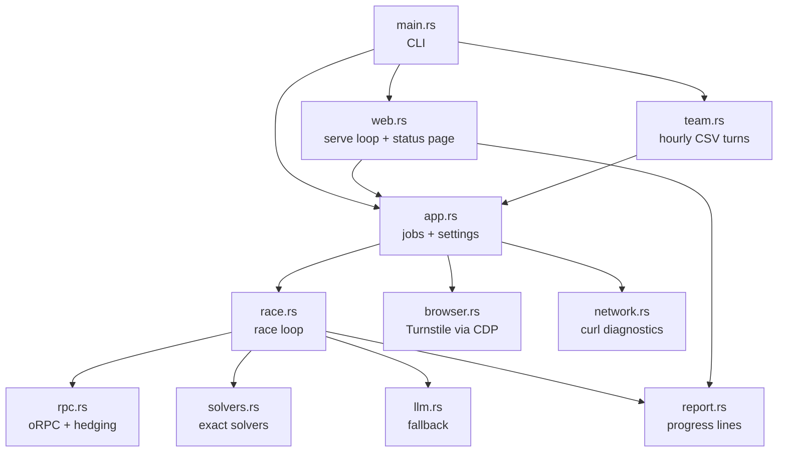
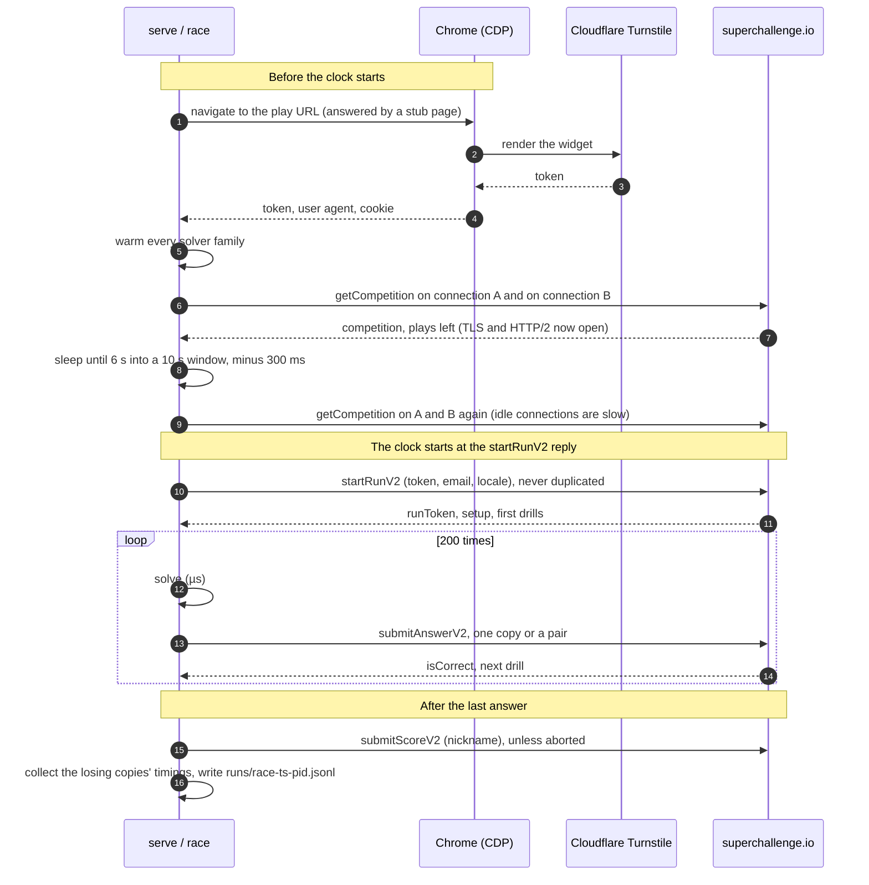
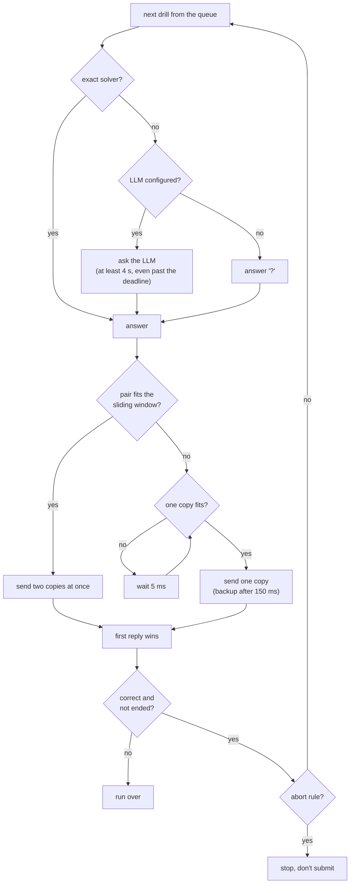
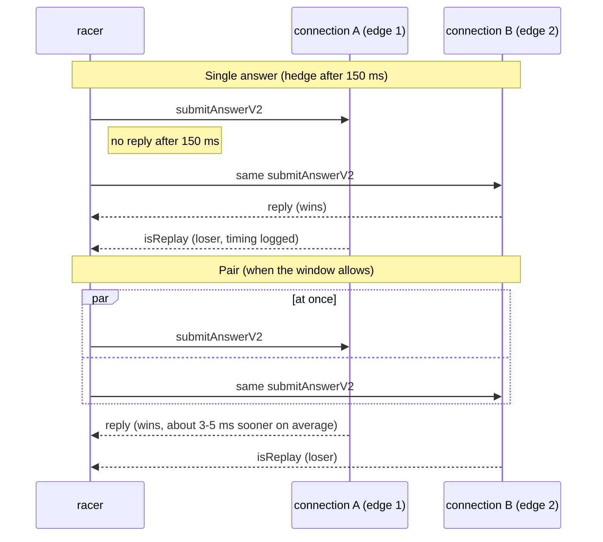
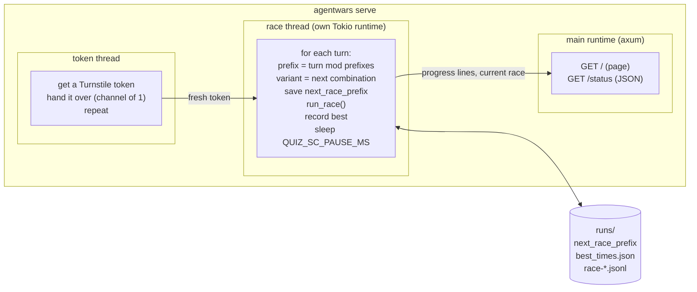
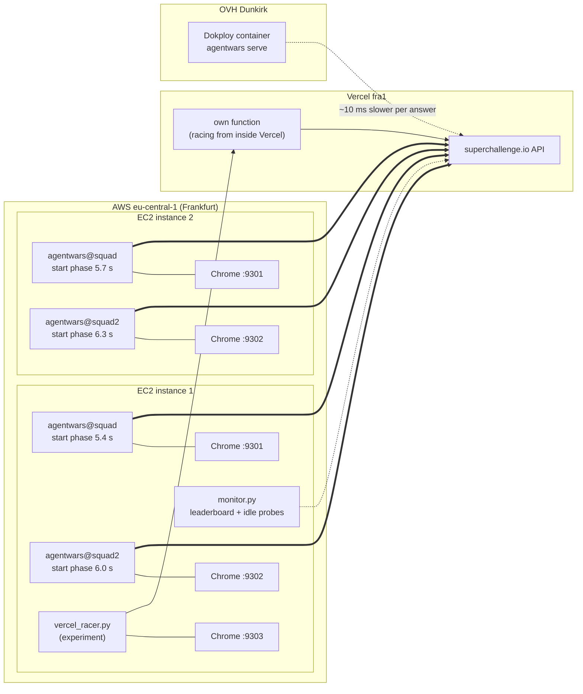

# Architecture

How the AMUNDI STU SQUAD racer is built, from a single question up to the
deployment that took first place. Diagrams use Mermaid, which GitHub renders.

- [The problem in numbers](#the-problem-in-numbers)
- [Modules](#modules)
- [Life of a race](#life-of-a-race)
- [One question](#one-question)
- [Hedged and paired requests](#hedged-and-paired-requests)
- [The rate limit and the start phase](#the-rate-limit-and-the-start-phase)
- [Aborting slow races](#aborting-slow-races)
- [The Turnstile token](#the-turnstile-token)
- [Solvers](#solvers)
- [serve: racing without stopping](#serve-racing-without-stopping)
- [Logs](#logs)
- [Deployment](#deployment)

## The problem in numbers

A run is 200 questions, strictly one after the other: the next question only
arrives in the reply to the previous answer. The leaderboard time runs from
the `startRunV2` reply to the last answer, so for a perfect run:

```
elapsed ≈ Σ over 200 answers (solve time + network round trip + server time)
           └── µs ──┘   └ ~1 ms from Frankfurt ┘  └ 30-50 ms ┘
```

Solving costs microseconds, and from AWS Frankfurt the network costs about a
millisecond. Almost all of the time is the server's, so the design aims to
(1) never add anything to the critical path, (2) shave the server's time where
the protocol allows it (pairs, warm connections, edge choice) and (3) race as
often as possible, to catch the server when it's fast.

## Modules



| Module | Responsibility |
|---|---|
| `main.rs` | Subcommands and the `serve` setting lists (clap, every flag has an env var) |
| `app.rs` | Shared settings (`Common`, `RaceArgs`), and `race`, `dry-run`, `bench`, `cookie-bench`, `token` |
| `race.rs` | Session (warm connections), start phase, the question loop, pair decisions, the sliding-window model, abort, in-memory log |
| `rpc.rs` | `POST /api/rpc/superchallenge/<procedure>` with `{"json": input}`. Per-connection reqwest clients, edge IP pinning, response timing (headers vs body, peer, `x-vercel-id`, `Server-Timing`), and `hedged()` |
| `solvers.rs` | Prompt parsing and one exact solver per puzzle family, plus the warmup set |
| `llm.rs` | Optional OpenAI-compatible `chat/completions` fallback |
| `browser.rs` | Launches or attaches to headless Chrome and gets a Turnstile token, user agent and cookie |
| `web.rs` | `serve`: email/attempt rotation, saved positions, token prefetch, settings rotation, best times, status page |
| `team.rs` | `team`: every interval, the next CSV member races their attempts |
| `network.rs` | Fresh curl connections for DNS/TCP/TLS/TTFB breakdowns (`bench` only) |

## Life of a race

Everything slow happens before `startRunV2`. Once the run has started, the
loop only solves and sends.



`startRunV2` is never retried or hedged: a second call could spend a second
attempt. In `serve`, a failure before the "starting the run" line (Turnstile,
warmup) gives the attempt back. After that line the attempt counts as spent.

## One question



The deadline follows the client's own ramp: 5 s for the first question, down
linearly to 2 s at question 40 (`deadline_ms`). With exact solvers it only
matters for the LLM fallback, which gets whatever is left of it (and at least
4 s, since a late answer is no worse than `?`).

## Hedged and paired requests

`rpc::hedged` sends the same request on up to `max_requests` copies across
the connections, round robin, and returns the first success. The server
treats a repeated answer as a replay (`isReplay: true`), so extra copies are
harmless. Only the request budget limits them.



- A `429` (rate limit) stops duplicates for the rest of the run. The answer
  is resent alone after 150 ms.
- A `409` means the run is over (too late). The loop stops, but the score can
  still be submitted.
- Transport errors move on to the next connection at once. Other HTTP
  errors fail the race.
- Losing copies keep reading in a background task, and their timings join
  the log at the end of the race without slowing the loop.
- `QUIZ_SC_EDGE_IPS=a+b` pins connection A to edge `a` and B to edge `b`
  (rustls still checks the certificate for `superchallenge.io`), so the two
  copies of a pair take different paths.

## The rate limit and the start phase

The server limits each run (`429 TOO_MANY_REQUESTS`, `scope: run`, the same
from any IP) to about 250 answer requests per 10 s, counted as a sliding
window over fixed clock windows:

```
estimate(t) = count(current window) + count(previous window) × (1 − elapsed fraction of the current window)
```

A race of about 7-10 s that starts at the beginning of a window has its 200
answers in that one window, so only about 50 of them can be pairs. Started
**6 s into a window**, the race spans two windows. The first one's count
fades out while the second fills up, and about 135 answers can go out as
pairs:

```
clock   0s        6s   10s             16s  20s
        |---------|----|---------------|----|
window  [  window n    ][   window n+1      ]
race              [=====================]
                  start                 end (~7 s later)
pairs             ^^^^^^ most of them ^^^^^ (the previous window's weight falls)
```

`Allowance` in `race.rs` keeps its own count per window, so the racer never
needs to see a 429 to know where it stands. The pair rule looks ahead: a pair
goes out only if, after it, every answer still to come fits **alone**, at 35 ms
each, under `limit − reserve`:

```rust
// race.rs, Allowance::pair_fits (simplified)
plan.record(now, 2);                       // this pair
for k in 1..=answers_left {                // then every answer left, one by one
    plan.record(now + 35ms * k, 1);
    if plan.estimate(now + 35ms * k) > limit - reserve { return false; }
}
true
```

An earlier greedy rule (pair whenever the count allows) left the last 20 or
so answers of a long race waiting 60-230 ms for the window to free up.
`scripts/simulate.py` replays the rule over real answer times. With the
look-ahead there are no waits, it's 80-100 ms faster, and any start phase
from 5.4 to 6.6 s is within about 50 ms.

## Aborting slow races

The server's speed changes from one minute to the next, and a race's first
answers predict the rest. `Abort` stops a race (and skips `submitScoreV2`)
when:

- its first `QUIZ_SC_ABORT_AFTER` answers took more than `QUIZ_SC_ABORT_MS`
  (in the end 30 answers / 4000 ms, so only very bad starts), or
- with `QUIZ_SC_ABORT_TARGET_MS` set, from then on the race can't beat the
  target even if every answer left took `QUIZ_SC_ABORT_FAST_MS`.

`QUIZ_SC_FULL_EVERY=10` keeps one cycle in ten unaborted, so the full-race
statistics aren't biased.

## The Turnstile token

`startRunV2` needs a Cloudflare Turnstile token, and that token needs a real
browser. `browser.rs` talks to Chrome over the DevTools protocol directly
(a websocket with `tokio-tungstenite`, no browser-automation library):

1. Launch headless Chrome with a normal (non-`HeadlessChrome`) user agent and
   `--disable-blink-features=AutomationControlled`, or attach to a running
   one with `QUIZ_SC_CDP_URL`.
2. Intercept the play page request (`Fetch.enable`) and answer it with a tiny
   stub that only loads the Turnstile script, so the widget runs on the real
   origin without downloading the site (about 2 s per token).
3. Render the widget with the site key and wait for the callback, then read
   the origin's cookies.
4. Kill a launched Chrome right away, to free the CPU before the race.

In `serve`, a separate thread keeps one token ready while the current race
runs, and drops tokens older than 240 s (they expire at 300 s). On the race
hosts each racer attached to its own persistent Chrome service at `nice 19`:
launching a Chrome for every token on three racers saturated the CPU.

## Solvers

`segments()` splits a prompt on `|` into labelled parts (`TEXT:`, `TASK:`,
`LIST:`, `START:`, `EXAMPLES:`, `GRID (...)`). Unlabelled and `SYSTEM:`
segments are distractors and are ignored. `solve()` matches the `TASK` against
one regex per family and returns `None` unless it understands the whole task.

| Family | Example task |
|---|---|
| Letter count | `how many times does the letter V appear` |
| Kind count | `how many vowels / consonants / letters / words are there` |
| Caesar shift | `apply ROT13`, `shift every letter backward by 3` |
| Word position + steps | `take word number 2, counting from the end, reverse it, drop every vowel, uppercase` |
| Extremes | `the word before the longest word` (a tie returns `None`) |
| Reverse | `write it backwards` |
| Arithmetic | `compute (309 * 12 + 64) mod 97`, with `^`, `x`, `//`, Python-style floor division |
| Odd one out | `exactly one character is a digit, give its position, counting from 1` |
| Moves | `START at 0,0 \| MOVES: URDL (U adds 1 to y, ...) \| TASK: the final position` |
| Tokens | `you hold 5 red tokens ... You do NOT take 2 red tokens ... how many blue tokens do you hold` |
| Hidden rules | `EXAMPLES: adac -> ycdyg ; aac -> ycyg \| TASK: the same hidden rules transform ddac into what` |
| Grids | `rotate the grid 90 degrees clockwise, then read the rows left to right` |
| Bracket nesting | `the maximum nesting depth, then the position of the bracket where that depth is first reached` |

`warm()` runs one representative prompt per family before each race, so regex
compilation and first-use allocation happen off the clock. `tests/corpus.rs`
replays every logged prompt. Verified answers must match, and answers the
server rejected must never come back.

## serve: racing without stopping



- **Emails.** Each prefix makes `{prefix}{i}@amundi.com`, and each email gets
  `QUIZ_SC_ATTEMPTS_PER_EMAIL` races. The position is saved *before* each
  race, so a crash never repeats an attempt. A higher `QUIZ_SC_EMAIL_START`
  can only move it forward.
- **Experiments.** Every `*_LIST` setting (hedge delay, edge pair, follow the
  winner, headers, pause before answering, stub or real page, duplicates)
  adds a dimension. `serve` runs every combination in turn, so they share the
  same server conditions, and writes the combination to the log's `start`
  event.
- **Isolation.** The race has its own thread and runtime, so a page view can
  never delay an answer.

## Logs

One JSONL file per race, `runs/race-<unix ts>-<pid>.jsonl`, written after the
race. Each line has `t` (unix seconds) and `event`:

| Event | Fields |
|---|---|
| `start` | the `startRunV2` response (setup, first drills) and the `variant` (every setting of this race) |
| `answer` | `index`, `drill`, `submission`, `source` (`exact`/`llm`/`none`), `solve_ms`, `rtt_ms`, `headers_ms`, `body_ms`, `requests`, `pair`, `winner_route`, `http_version`, `peer`, `x_vercel_id`, `server_timing`, `response` |
| `score` | the `submitScoreV2` response |
| `loser` | per losing copy: `index`, `route`, `headers_ms`, `x_vercel_id`, `replay`, `error` |
| `error` | the error and the server's response body |

The scripts in `scripts/` work from these files only.

## Deployment

The API runs on Vercel's Frankfurt region (`fra1`), so the racers that counted
ran on AWS `eu-central-1`, about 0.7 ms away.



- **Four racers, staggered.** Each instance runs two `agentwars@<name>`
  systemd template units, each with its own env file (email prefix, page
  port, start phase, Chrome port), and nginx serves the status page
  read-only (GET only) on port 80. Start phases are 0.3 s apart: racers
  starting at the same instant slowed each other by about 3 ms per answer.
  Six racers made every answer about 1.8 ms slower than two, with no more fast
  races, so four raced.
- **No two racers share an email prefix**, since each keeps its own attempt
  counter.
- **Build locally, copy the binary.** The LTO release build is too heavy for
  the small instances. The binary is built on an older glibc than the
  servers', so it runs as-is.
- **The Dokploy container** (built from this repo's `Dockerfile` on every
  push to `main`) raced as well and served a public read-only page. From
  Dunkirk each answer cost about 10 ms more, so it couldn't set the best time.
- **The Vercel experiment** ran the same binary inside a Vercel function in
  `fra1`, driven by `scripts/vercel_racer.py`. That function's source is not
  in this repository.
